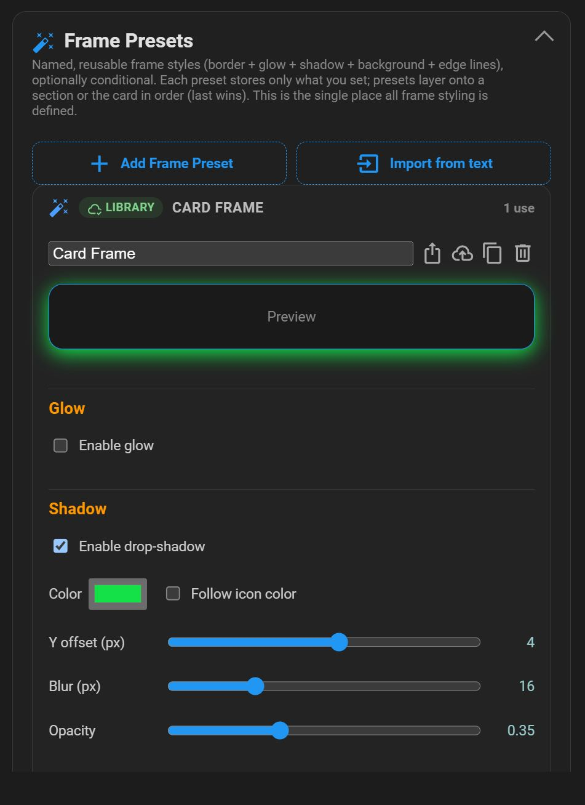
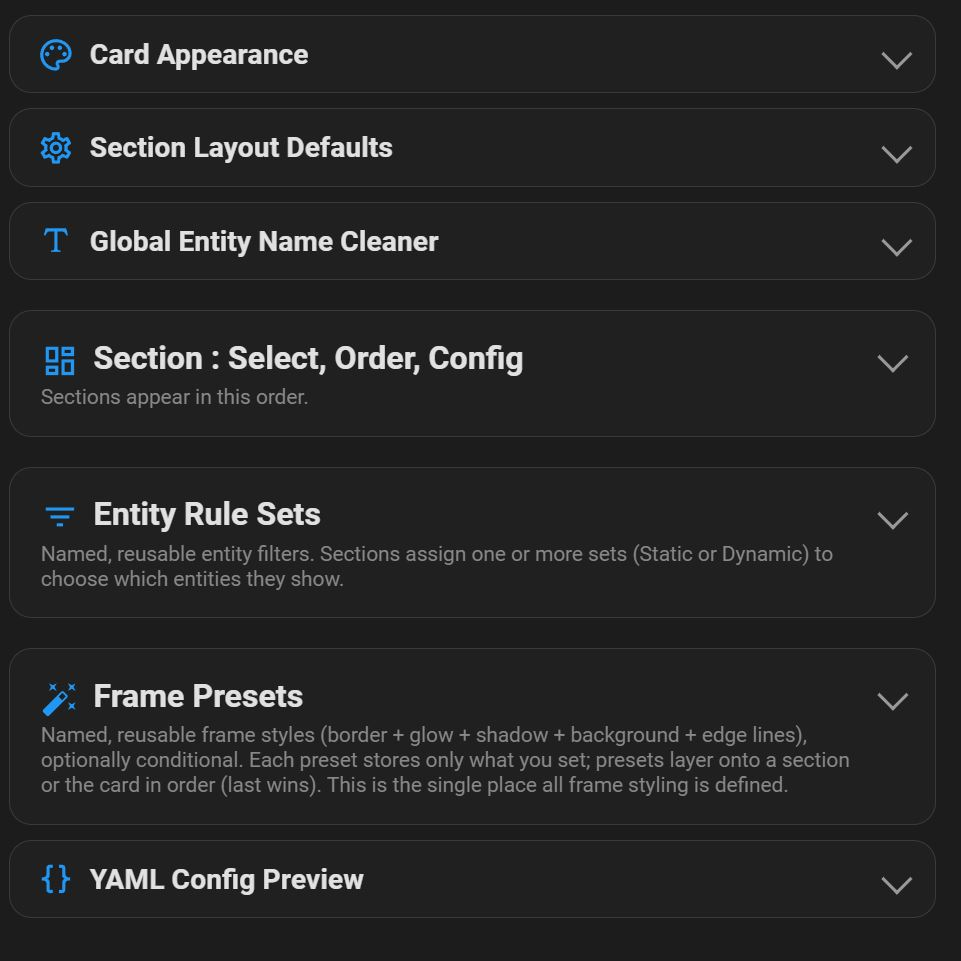
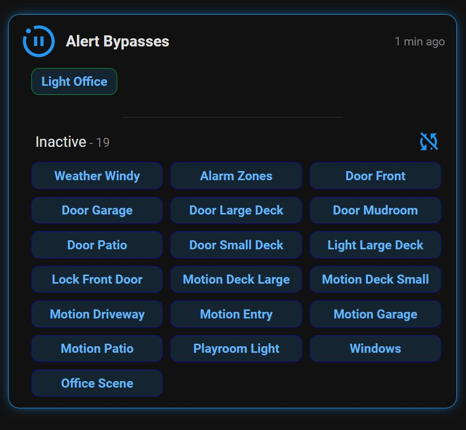
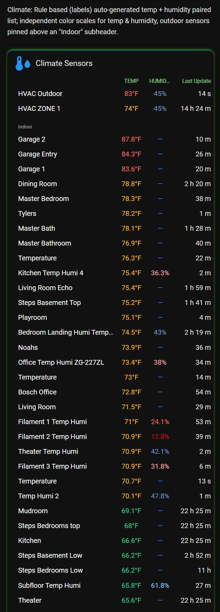
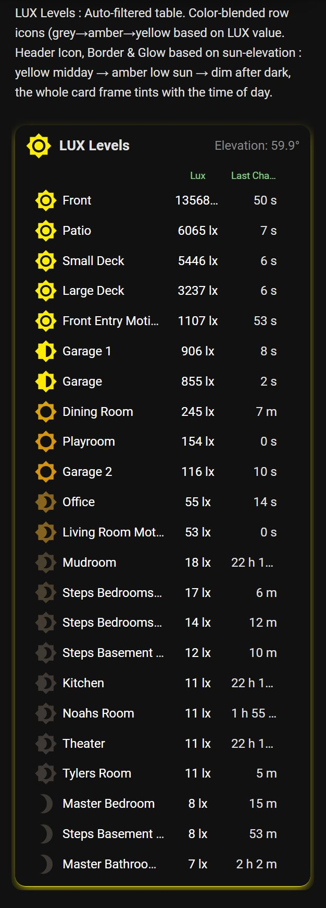
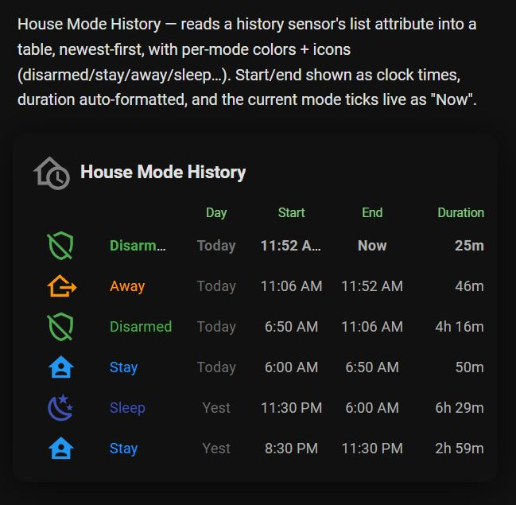
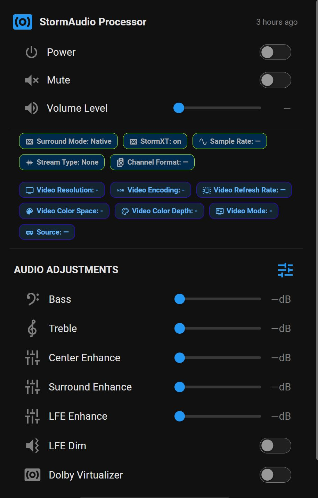
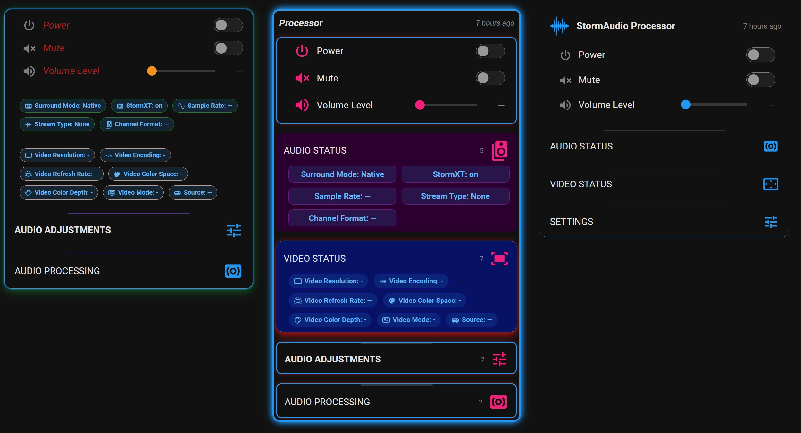

# Easy Entity Styler Card

A highly customizable dashboard card that organizes and displays your entities in a clean way while giving you full control over the look and behavior of your entity cards. Bonus: 1000x easier and better performance than card-mod.

* **Hundreds of styling options** — card-wide, per section, and per entity
* **Reusable Rule Sets, Frame Presets, and a shared Preset Library**
* **Entity Tables** with rule-based color / icons / sorting

... all in a super easy to use Visual Editor — YAML optional, never required

https://github.com/Ltek/easy-entity-styler-card

### ✨ Features

* **Extensive Rules Engine for filtering** – A global, reusable, point-and-click filtering engine — no raw YAML or templates.
  * Build named **Rule Sets** once and assign them to any number of sections.
  * Each set is a flat list of **Include / Exclude rule groups** (match **ALL** or **ANY**) — an entity shows when it passes every Include group and matches no Exclude group.
  * Match on entity ID, name, state, attribute, domain, area, **Labels**, **Group helpers**, integration, or device class, with operators like equals / contains / in / regex / numeric compare.
  * **Live dropdowns** pull the real values from your system and show friendly display names.

* **Static & Dynamic entity lists (auto-entities-like)** – Populate sections automatically from a Rule Set, without hand-listing entities.
  * **Dynamic** – re-evaluated live: entities appear/disappear as they start/stop matching.
  * **Static** – a one-time snapshot you can hand-curate; refresh any time with one click.
  * **Preview** the resolved entities before assigning, and "update all sections" that use a set at once.

* **Everything in the Visual Editor** – Every feature below is fully point-and-click; YAML is optional, never required.
  * Per-group **Reset** buttons, inherit-vs-custom toggles, and live preview.

* **Color Blender (gradient by value)** – Give any icon or text color a smooth, value-driven gradient instead of hard color steps.
  * Define **value → color stops** (e.g. 10 lux → dark grey, 900 lux → bright yellow); the card interpolates every shade in between.
  * As many stops as you like for multi-color ramps; values below/above the ends clamp to the nearest stop.
  * Discrete rules still take precedence, so you can special-case states (e.g. "off") before the ramp.

* **State-driven header icon (by an entity)** – The section header icon can change **glyph and color from any entity's value**, not just the section's own count.
  * Point it at any entity (e.g. `sensor.sun_solar_elevation`) and set rules — e.g. brightness glyphs that ramp with the sun's elevation, or shield-check/green ↔ shield-alert/yellow by an alarm state.
  * Pull an arbitrary entity's value into any title/header text with **`{entity:sensor.x}`** / **`{entity:sensor.x:attribute}`** tokens.

* **Entity Tables** – Render entities (or list data) as a rich, multi-column table.
  * Columns for icon, name, value, "last changed" age, change time, or any attribute.
  * Point-and-click **color coding** and **state/time-based icon rules** per column.
  * Show each entity's **own native HA icon**, or override the glyph by state.
  * **Flexible column widths** — px / % / fr / Auto — for responsive scaling.
  * **Rule-based sorting** with weights, tie-breakers, and pin-to-top.
  * Templated **title row** — name/count/newest/oldest tokens, a **state-driven header icon** (swap glyph + color), and custom **"All Secure"-style text** when the count is 0.
  * Global **Table Defaults**: set your house style once and every new table inherits it.

* **Tables from a sensor's array attribute** – Drive a table from an attribute that holds a **list of objects** (e.g. a history/log sensor), rendering **one row per element**.
  * Point the table's **Row Source** at the entity + attribute (e.g. `sensor.house_mode_history` → `history`).
  * Set each column's value **Source** to **Array field** and name the field (`mode`, `start`, `end`, …).
  * Use the **Timestamp → time / date** and **Seconds → duration** transforms for time fields.
  * An element with no `end` renders live as **"Now"** with a ticking duration; enable **reverse** for newest-first.

* **Collapsible sections & card** – Sections expand/collapse individually; the whole card can collapse to just its title bar (or run with no title bar). Sections can auto-stay-open whenever they have entities.

* **Conditional display & section rules** – Show each entity only when it passes your rules (compare a value to a constant or another entity, chained AND/OR, live). Auto-hide a section when it has nothing to show, and show a live, fully-styled entity **count** in the header.

* **Chips** – Colorful, compact chips for instant readability, in wrap / column / grid layouts, optional per section, with separate **tap and hold actions** (more-info, toggle, navigate, URL, call-service).

* **Native entity controls** – Toggle switches, adjust sliders, and interact with entities just like standard HA cards.

* **Frame Presets (borders / glow / shadow / background / edge lines)** – All frame styling lives in one place: named, reusable **Frame Presets** you layer onto a section or the whole card.
  * Each preset is **sparse** — it stores only the properties you set (a "bottom glow" preset touches nothing else), so presets stack cleanly: apply an ordered list to any section or the Card Wrapper and the **last one wins per property**.
  * Presets can be **conditional** — apply only when an entity is in a given state, or when a section currently **has / has no** visible entities (e.g. the card glows only while something is active).
  * Border color / glow / shadow can **follow the section's icon color**, per-side borders + glow, per-side gradient **edge lines**, and background — all point-and-click with a live preview swatch.

* **Preset Library (share styles across cards & systems)** – Save a Frame Preset to a **shared library** that lives in Home Assistant (no add-on or integration needed) and reference it from any card as `lib:<name>`.
  * Edit a library preset once and **every card using it updates live**.
  * **Local ↔ Library** badges show where each preset lives; **Save to Library** publishes and links a card to it; **Detach** forks a library preset back to a local copy.
  * **Export / Import** presets as text to share a great style with someone on another system.

* **Colors, fonts & scaling** – Global color palette (text, icons, chips, dividers…), independent **scale sliders** (overall, icons, title icon/text, entity text), per-section header/row/chip styling, a **secondary info line** under entity names, and an **Entity Name Cleaner** (strip text like "Living Room") card-wide or per section.

### 🚀 Installation

1. Create the folder `\config\www\community\easy-entity-styler-card`
2. Download [`easy-entity-styler-card.js`](https://github.com/Ltek/seed-card/blob/main/easy-entity-styler-card.js) and place it in that folder.
3. Add as a Dashboard Resource:

   * Go to Settings > Dashboards > three-dot menu > Add Resource
   * Enter `/local/community/easy-entity-styler-card/easy-entity-styler-card.js` and select "JavaScript Module"
   * Click "Add"
4. Clear your browser cache and refresh.

### 📸 Screenshots

Example showing just a fraction of the available options...

<!-- SCREENSHOTS:START -->
<table>
  <tr>
    <td align="center" valign="top">
      
    </td>
    <td align="center" valign="top">
      
    </td>
    <td align="center" valign="top">
      
    </td>
    <td align="center" valign="top">
      
    </td>
  </tr>
  <tr>
    <td align="center" valign="top">
      
    </td>
    <td align="center" valign="top">
      
    </td>
    <td align="center" valign="top">
      
    </td>
    <td align="center" valign="top">
      
    </td>
  </tr>
  <tr>
    <td align="center" valign="top">
      
    </td>
    <td align="center" valign="top">
      
    </td>
    <td></td>
    <td></td>
  </tr>
</table>
<!-- SCREENSHOTS:END -->