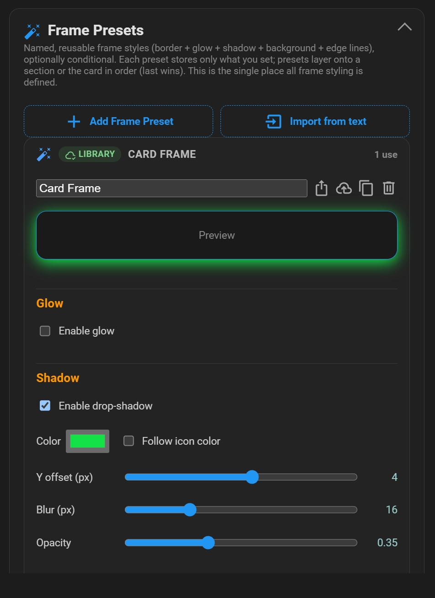
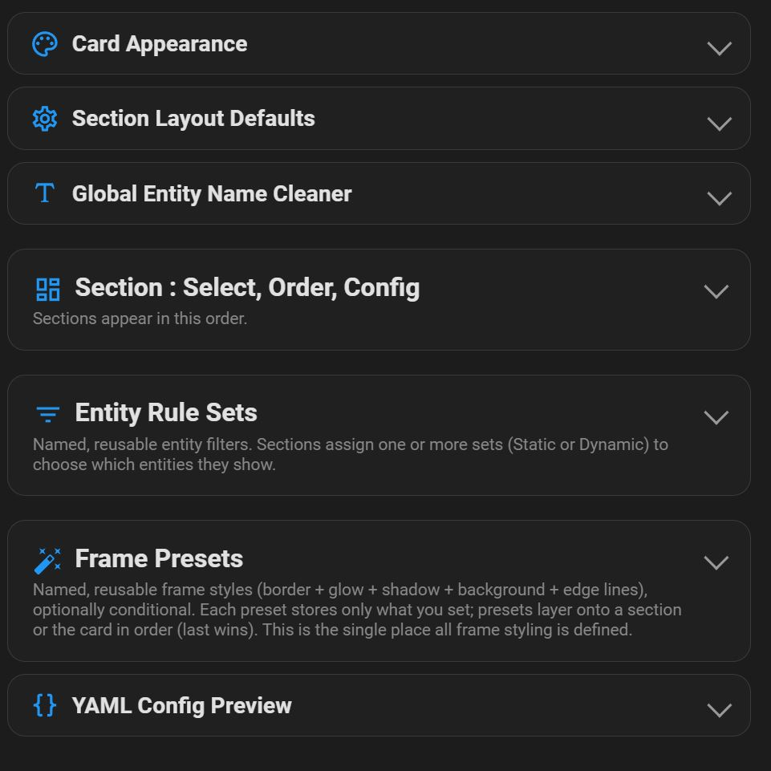
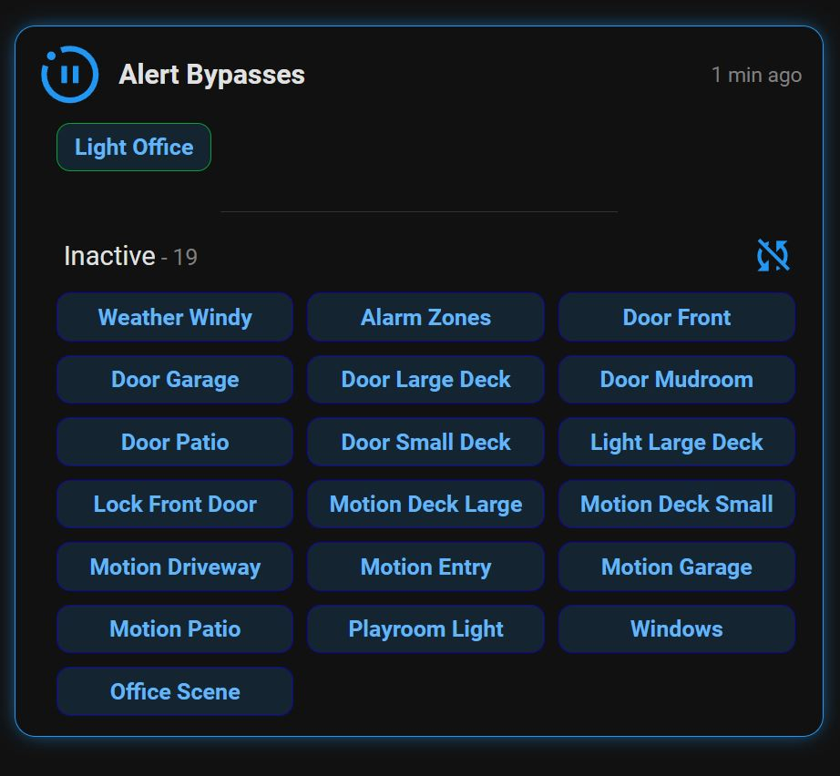
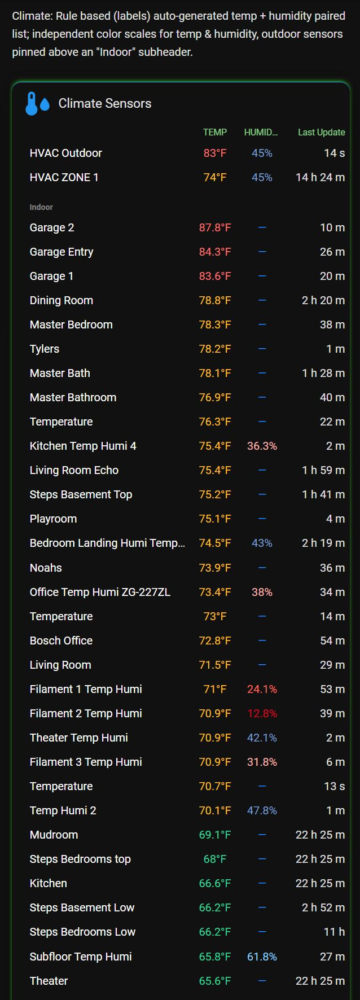
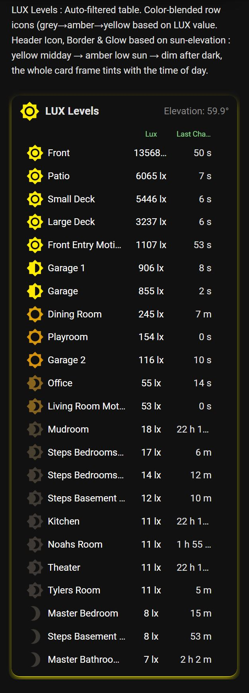
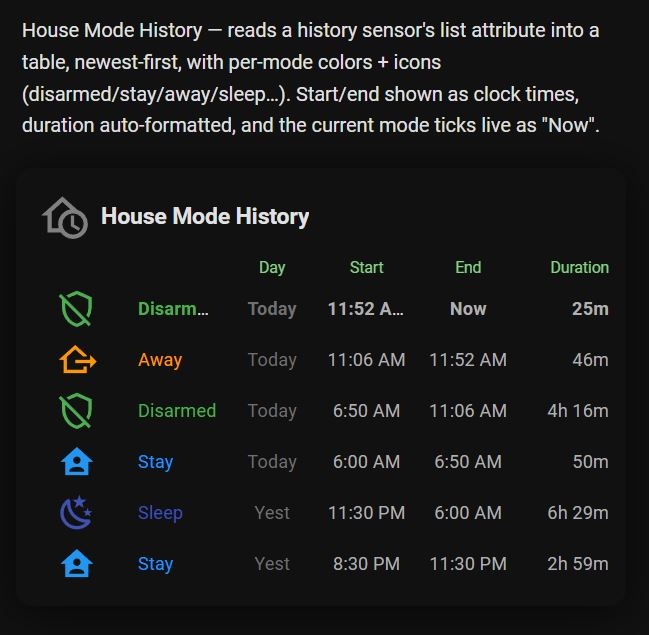
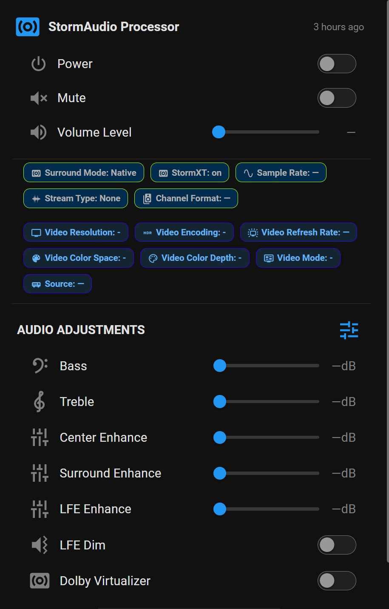
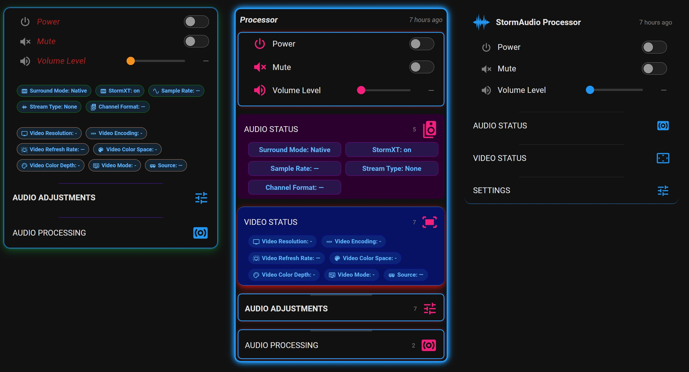

# Easy Entity Styler Card

A highly customizable Home Assistant Dashboard card that organizes and displays your entities cleanly while giving you full control over the look and behavior of your entity cards. Bonus: far easier and far better performance than card-mod.

* **Hundreds of styling options** — card-wide, per section, and per entity
* **Reusable rule sets, shared style libraries, and rich entity tables**
* **Everything in a visual editor** — YAML optional, never required

https://github.com/Ltek/easy-entity-styler-card

Current build: **v2026.09.07.205**

---

## What's new (2026-09-07)

- **Conditional Visibility** — show the whole **card** or any individual **section** only when your rules pass (entity + operator + value, chained with AND/OR). Editor-safe: hidden cards/sections stay visible while editing or previewing the dashboard.
- **Copy sections between cards** — export any section (with its referenced rule sets) as JSON and import it into another card.

---

## What's new (2026-08-31)

- **Per-location Frame Style condition override** — a card/section can override an applied conditional Frame Style's condition (entity + operator + value) without changing the shared library style.
- **Auto-migrate local Frame Styles** — any leftover card-local frame presets are published to the shared System library on edit (collision-safe, one-time).
- **Library UI refresh** — Frame Styles, Header Rules, and Entity Filter Rules now use a cleaner flat list (two-line rows, muted subtitle, lock icon on Built-In, theme-color accent when expanded).
- **Section Layout & Config polish** — even row height/spacing, accent icons, and lighter labels.
- **Fixes** — Frame Style live preview now updates on slider/color edits.

---

## Options at a glance

Every option below is fully point-and-click in the visual editor.

### Sections & layout
- **Collapsible sections and card** — sections expand/collapse individually; the whole card can collapse to just its title bar (or run with no title bar); sections can auto-stay-open when they hold entities.
- **Two section types** — *Entities* (rows and/or chips) and *Entity Tables* (rich multi-column tables).
- **Conditional visibility** — show the whole card, a section, or an entity only when your rules pass (entity + operator + value, chained AND/OR); auto-hide a section when it has nothing to show. Hidden cards/sections still appear while editing the dashboard.
- **Copy sections between cards** — export a section (with its rule sets) as JSON and import it elsewhere.

### Entity selection
- **Rules engine** — build named, reusable rule sets with point-and-click include/exclude groups (match ALL or ANY); match on id, name, state, attribute, domain, area, label, group helper, integration, or device class, with operators like equals / contains / in / regex / numeric compare. Live dropdowns pull real values from your system.
- **Static & dynamic lists** — populate a section automatically from a rule set (dynamic re-evaluates live; static is a hand-curatable snapshot). Preview resolved entities before assigning.

### Entity tables
- Multi-column tables from your entities or from a sensor's array attribute (one row per element).
- Columns for icon, name, value, "last changed" age, change time, or any attribute; flexible widths (px / % / fr / auto).
- Rule-based color coding, state/time-based icon rules, rule-based sorting with pin-to-top, templated title row, and global table defaults.

### Appearance & styling
- **Colors, fonts & scaling** — global palette plus independent scale sliders (overall, icons, title icon/text, entity text); per-section header/row/chip styling; a secondary info line under entity names.
- **Chips** — compact, colorful chips in wrap / column / grid layouts, with separate tap and hold actions.
- **Color blender** — smooth value-driven color gradients for any icon or text color (value → color stops, interpolated).
- **State-driven header icons** — a section or title header icon whose glyph and color change from any entity's value; pull entity values into title text with `{entity:…}` tokens.
- **Entity name cleaner** — strip repeated text (e.g. "Living Room") card-wide or per section.
- **Frame Styles** and **Header Rules** — see **Libraries** below.

### Interaction
- **Native entity controls** — toggle switches, adjust sliders, and interact with entities just like standard HA cards.

---

## Libraries

Both this card and the **Color Light & Scene Manager** card share the same two style libraries, stored in Home Assistant's built-in frontend key/value store — **no add-on or custom integration required**. A style you save in one place is available to every card of either type on the instance, and edits propagate live.

- **Scope is system-wide.** Libraries are shared across all users of the instance (Dashboard editing is admin-only, so there's a single shared author). There is no per-user scope.
- **Built-In styles are read-only.** Each library ships with a set of Built-In examples you can't overwrite; **duplicate** one to create an editable copy.
- **Edit once, updates everywhere.** A card references a library entry by name; editing that entry updates every card using it, live — no reload.
- **Portable.** Any entry can be **exported** as text and **imported** on another system to share a style with someone else.

### Frame Styles
Named, reusable frame bundles — borders, glow, shadow, background, and per-side edge lines. Each style is **sparse** (it stores only the properties you set), so you can layer an ordered list on a section or the whole card and the last one wins per property. Styles can be **conditional** — applied only when an entity is in a given state, or when a section currently has / has no visible entities.

*Storage key:* `ltek_frame_library`

### Header Rules
Named, reusable, state-driven header styling. A rule set is an ordered list of rules (a condition → the outputs it sets) plus optional defaults. Outputs can set the header's **icon color, icon glyph, text color, icon size, text size,** and a **secondary text line** driven by an entity value. Outputs are sparse — anything left "Not set" defers to the card's own header look — and revert automatically when a rule stops matching. Apply a set to the card title and/or to any section.

*Storage key:* `ltek_header_library`

---

## Installation

1. Create the folder `\config\www\community\easy-entity-styler-card`.
2. Download [`easy-entity-styler-card.js`](https://github.com/Ltek/easy-entity-styler-card) and place it in that folder.
3. Add it as a Dashboard resource:
   - **Settings → Dashboards → ⋮ → Resources → Add Resource**
   - URL: `/local/community/easy-entity-styler-card/easy-entity-styler-card.js`  ·  Type: **JavaScript Module**
4. Clear your browser cache and hard-refresh.

---

## Screenshots

<!-- SCREENSHOTS:START -->
<table>
  <tr>
    <td align="center" valign="top">
      
    </td>
    <td align="center" valign="top">
      
    </td>
    <td align="center" valign="top">
      
    </td>
    <td align="center" valign="top">
      
    </td>
  </tr>
  <tr>
    <td align="center" valign="top">
      
    </td>
    <td align="center" valign="top">
      
    </td>
    <td align="center" valign="top">
      
    </td>
    <td align="center" valign="top">
      
    </td>
  </tr>
</table>
<!-- SCREENSHOTS:END -->
